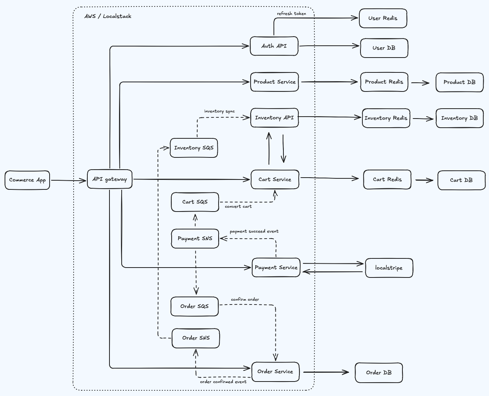

# Nex-Shop

Nex-Shop is a modern, microservices-based e-commerce platform designed for performance, scalability, and robustness. It features a Next.js frontend and a set of NestJS-based backend services, integrated with an event-driven architecture using AWS SNS/SQS.

## 📺 User Journey Preview


## 🏗️ Architecture



Nex-Shop follows a microservices architecture with the following components:

- **Frontend**: A Next.js web application (`ecomm-web`).
- **Backend Services**:
  - `auth-api`: Authentication and user management.
  - `product-api`: Product catalog and details.
  - `inventory-api`: Inventory management and stock reservations.
  - `cart-api`: Shopping cart management with real-time stock checks.
  - `order-api`: Order processing and management.
  - `payment-api`: Payment processing and webhook handling.
- **Event-Driven Integration**: Services communicate asynchronously using **AWS SNS/SQS** (e.g., payment status updates, inventory synchronization).
- **Caching & Sessions**: **Redis** is used across services for distributed caching and session management.
- **Payment Emulation**: **localstripe** is used to emulate the Stripe API locally, allowing for end-to-end testing of payment flows without external dependencies.
- **Serverless**: Backend services are designed to be deployed using the **Serverless Framework** to AWS Lambda.
- **Local Development Infrastructure**: Uses **LocalStack** to emulate AWS services (Lambda, API Gateway, SNS, SQS, S3) and **Docker** for containers like PostgreSQL, Redis, and **localstripe**.

## 🛠️ Tech Stack

### Frontend

| Technology                                 | Why                                                                                                                                                                                                                                        | Trade-offs                                                                                                                                            |
| ------------------------------------------ | ------------------------------------------------------------------------------------------------------------------------------------------------------------------------------------------------------------------------------------------ | ----------------------------------------------------------------------------------------------------------------------------------------------------- |
| [Next.js 16](https://nextjs.org/)          | Server Components and App Router enable hybrid rendering (SSR, SSG, streaming) out of the box, which suits an e-commerce storefront where SEO and time-to-first-byte matter. Built-in API routes reduce the need for a separate BFF layer. | Tighter coupling to Vercel's ecosystem. The App Router's mental model (server vs. client components) adds complexity compared to a plain React SPA.   |
| [React 19](https://react.dev/)             | Industry-standard UI library with the largest ecosystem. React 19 brings Actions, `useOptimistic`, and improved Suspense—useful for cart/checkout flows that need optimistic updates.                                                      | Larger bundle than lighter alternatives (Preact, Solid). React's abstraction layers can obscure performance issues in large component trees.          |
| [Tailwind CSS 4](https://tailwindcss.com/) | Utility-first approach keeps styles co-located with markup, speeds up prototyping, and produces small production bundles via purging. v4 offers CSS-native theming with `@theme`.                                                          | Verbose class strings reduce template readability. Harder to enforce a consistent design system compared to component libraries like Chakra or Radix. |

### Backend

| Technology                                                          | Why                                                                                                                                                                                                                                  | Trade-offs                                                                                                                                                                                                       |
| ------------------------------------------------------------------- | ------------------------------------------------------------------------------------------------------------------------------------------------------------------------------------------------------------------------------------ | ---------------------------------------------------------------------------------------------------------------------------------------------------------------------------------------------------------------- |
| [NestJS 11](https://nestjs.com/)                                    | Opinionated, modular framework with first-class support for decorators, dependency injection, guards, and interceptors—makes enforcing cross-cutting concerns (auth, rate-limiting, validation) consistent across microservices.     | Decorator-heavy code can be harder to debug and test. The abstraction layer adds overhead compared to lightweight frameworks like Fastify alone.                                                                 |
| [TypeORM](https://typeorm.io/) / [Prisma 6](https://www.prisma.io/) | TypeORM (auth-api) integrates naturally with NestJS decorators and supports advanced relation mapping. Prisma (product/cart/inventory/order APIs) offers a type-safe query builder with auto-generated types and simpler migrations. | Two ORMs in one monorepo increases cognitive load. TypeORM's Active Record patterns can leak persistence logic into domain code. Prisma's query engine adds a binary dependency and cold-start weight in Lambda. |
| [Passport.js](http://www.passportjs.org/) + JWT RS256               | Strategy-based auth with asymmetric signing (RS256) allows services to verify tokens independently without sharing a secret—critical in a distributed microservices setup.                                                           | RS256 is slower than HS256 for signing. Key rotation requires coordinated deployment across services.                                                                                                            |
| [Argon2id](https://github.com/ranisalt/node-argon2)                 | Winner of the Password Hashing Competition. Resistant to both GPU and side-channel attacks (combines Argon2i + Argon2d).                                                                                                             | Higher memory and CPU cost per hash than bcrypt—requires tuning for Lambda's constrained environment. Native binary dependency can complicate cross-platform builds.                                             |

### Infrastructure & Messaging

| Technology                                                | Why                                                                                                                                                                                                           | Trade-offs                                                                                                                                                                                                              |
| --------------------------------------------------------- | ------------------------------------------------------------------------------------------------------------------------------------------------------------------------------------------------------------- | ----------------------------------------------------------------------------------------------------------------------------------------------------------------------------------------------------------------------- |
| [AWS SNS/SQS](https://aws.amazon.com/sns/)                | Managed pub/sub (SNS) + queue (SQS) decouples services for asynchronous workflows (payment → order status, inventory sync). No broker to operate, built-in dead-letter queues, and near-unlimited throughput. | Vendor lock-in to AWS. Higher latency than in-process event buses. Local testing requires emulation (LocalStack). Message ordering guarantees require FIFO queues with additional configuration.                        |
| [PostgreSQL](https://www.postgresql.org/)                 | Battle-tested relational database with strong ACID guarantees, JSON support, and rich indexing—well suited for transactional e-commerce data (orders, payments, inventory).                                   | Vertical scaling has limits. Schema migrations across multiple services require coordination. Managed options (RDS) add cost.                                                                                           |
| [Redis](https://redis.io/) (ioredis)                      | In-memory data store used for distributed caching (product catalog), session management, and rate-limiting (NestJS Throttler). Sub-millisecond reads reduce database load.                                    | Data is volatile by default—persistence (RDB/AOF) adds I/O overhead. Single-threaded model can bottleneck on CPU-intensive Lua scripts. Memory costs scale linearly with dataset size.                                  |
| [Serverless Framework 3](https://www.serverless.com/)     | Simplifies Lambda packaging, API Gateway configuration, and IAM role provisioning. Infrastructure-as-code in `serverless.yml` keeps deployment reproducible.                                                  | Cold starts add latency, especially with Prisma's binary engine. Less control over networking and concurrency compared to containers (ECS/Fargate). Debugging distributed Lambda traces is harder than monolithic logs. |
| [LocalStack](https://localstack.cloud/) + Docker          | Emulates core AWS services locally (Lambda, API Gateway, SNS, SQS, S3), enabling full end-to-end development and testing without an AWS account or cloud costs.                                               | Emulation fidelity is not 100%—edge cases may behave differently in real AWS. LocalStack itself consumes significant memory. Some services (e.g., IAM policy evaluation) are only partially supported.                  |
| [localstripe](https://github.com/adrienverge/localstripe) | Emulates the Stripe API for local payment testing, avoiding the need for Stripe test-mode credentials and network calls during development.                                                                   | Limited API surface—only covers common endpoints. Behavior may diverge from real Stripe on edge cases (webhooks, idempotency, SCA flows).                                                                               |

### Monorepo & Tooling

| Technology                              | Why                                                                                                                                                                                                            | Trade-offs                                                                                                                                                         |
| --------------------------------------- | -------------------------------------------------------------------------------------------------------------------------------------------------------------------------------------------------------------- | ------------------------------------------------------------------------------------------------------------------------------------------------------------------ |
| [Turborepo 2](https://turbo.build/repo) | Intelligent task scheduling with content-aware caching. Only rebuilds/retests packages that actually changed, dramatically reducing CI time in a multi-service monorepo.                                       | Adds a build orchestration layer to learn. Remote caching requires a Vercel account or self-hosted setup. Less flexible than Nx for custom generators and plugins. |
| [pnpm 9](https://pnpm.io/)              | Content-addressable storage deduplicates `node_modules` across the monorepo, saving disk space and install time. Strict dependency resolution catches phantom dependencies that npm/yarn would silently allow. | Stricter hoisting can break packages that rely on implicit dependency resolution. Some tools and IDEs have less mature pnpm support compared to npm/yarn.          |

### Testing

| Technology                                    | Why                                                                                                                                                                               | Trade-offs                                                                                                                                             |
| --------------------------------------------- | --------------------------------------------------------------------------------------------------------------------------------------------------------------------------------- | ------------------------------------------------------------------------------------------------------------------------------------------------------ |
| [Jest 30](https://jestjs.io/)                 | Standard test runner for NestJS backends. Mature mocking system, snapshot testing, and built-in coverage. v30 brings faster parallel execution.                                   | Slower startup than Vitest for large suites due to CommonJS transform overhead. Configuration can be verbose in monorepo setups.                       |
| [Vitest 4](https://vitest.dev/)               | Native ESM support and Vite-based transforms make it significantly faster than Jest for the Next.js frontend. API-compatible with Jest, so the migration path is straightforward. | Smaller ecosystem of plugins compared to Jest. Some edge cases with React Testing Library + server components still require workarounds.               |
| [Playwright](https://playwright.dev/)         | Cross-browser E2E testing with auto-waiting, network interception, and trace viewer. Covers real user flows (auth → checkout) that unit tests cannot.                             | Slower execution than unit tests. Flakiness in CI requires careful use of selectors and timeouts. Adds significant CI minutes for full browser matrix. |
| [Testcontainers](https://testcontainers.com/) | Spins up real PostgreSQL and Redis containers for integration tests, eliminating mocks and ensuring tests match production behavior.                                              | Requires Docker in the CI environment. Container startup adds seconds to each test suite. Resource-heavy when running many suites in parallel.         |
| [k6](https://k6.io/)                          | Scriptable load testing in JavaScript with built-in metrics, thresholds, and cloud reporting. Validates flash-sale scenarios and API performance under realistic concurrency.     | JavaScript-based scripts can hit performance ceilings for extreme load. Distributed execution requires k6 Cloud or manual orchestration.               |

## 📁 Project Structure

```text
├── apps/
│   ├── web/
│   │   └── ecomm-web/          # Next.js frontend
│   └── api/
│       ├── auth-api/           # Authentication service
│       ├── cart-api/           # Shopping cart service
│       ├── inventory-api/      # Inventory service
│       ├── order-api/          # Order service
│       ├── payment-api/      # Payment service
│       └── product-api/        # Product service
├── packages/
│   ├── eslint-config/          # Shared ESLint configuration
│   └── tsconfig/               # Shared TypeScript configuration
├── scripts/                    # Utility scripts for deployment and setup
├── docs/                       # Project documentation
└── load-tests/                 # Performance and load testing scripts
```

## 🚀 Getting Started

### Pre-requisites

- **Node.js**: v20.0.0 or higher.
- **pnpm**: `npm install -g pnpm`.
- **Docker**: For running infrastructure (PostgreSQL, LocalStack).
- **k6**: (Optional) For running load tests.

### Local Setup

1.  **Clone the repository**:

    ```bash
    git clone https://github.com/ahmadqosam/nex-shop.git
    cd nex-shop
    ```

2.  **Install dependencies**:

    ```bash
    pnpm install
    ```

3.  **Spin up infrastructure**:
    This command starts Docker containers for PostgreSQL and LocalStack.

    ```bash
    pnpm infra:up:localstack
    ```

4.  **Initialize Databases**:
    Run Prisma migrations for the services (example for `product-api`):

    ```bash
    cd apps/api/product-api
    pnpm prisma db push
    ```

    _(Note: You can repeat this for other services or use automated scripts if available)._

5.  **Run Development Environment**:
    Run all services and the frontend in development mode:
    ```bash
    pnpm dev:localstack
    ```

## 🧪 Testing

### End-to-End (E2E) User Journey

Simulates a full user journey from auth to payment:

```bash
pnpm test:e2e:journey
```

### Load Testing

Run performance tests using k6:

```bash
# Basic load test
pnpm test:load

# Stress test
pnpm test:load:stress
```

### Load Testing Results

Detailed analysis of system behavior under high concurrency (200 VUs):

- [Load Testing Results: Dev Server vs LocalStack](docs/load-testing-results.md)

## 🛠️ Development Tools

- **Scaffolding**: Generate a new service using `pnpm generate`.
- **Cleanup**: Close ports and cleanup data using `pnpm clean:ports` and `pnpm test:load:cleanup`.

---

For more detailed information on specific topics, check the `docs/` directory:

- [LocalStack Deployment](docs/localstack-deployment.md)
- [Generating a Service](docs/generating-a-service.md)
- [Load Testing Results](docs/load-testing-results.md)
